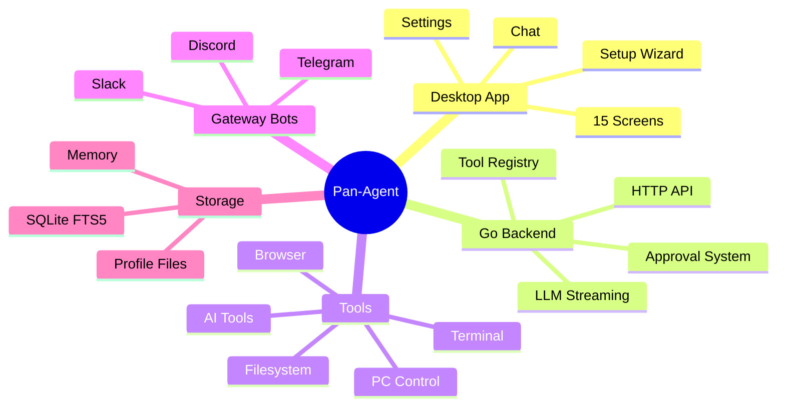

# Pan-Agent Home

This manual is user-first.

Open it with this mental model:
- Pan-Agent is a single Go binary that exposes an HTTP API on `localhost:8642`.
- The Tauri desktop app is one client of that API. The agent also works headless via CLI.
- Cross-platform: Windows, macOS, and Linux installers are all signed and auto-update.

If something is broken, assume you are debugging one of three layers:
1. the desktop app (Tauri webview, React UI)
2. the Go backend (HTTP server, LLM client, tools)
3. the external dependency (LLM provider API, messaging platform, OS-level permissions)

## Start here as a new user
- [[01 - Quick Start]]
- [[02 - Reading Guide]]
- [[01 - System Overview]]

## User-first reading path
1. [[01 - Quick Start]]
2. [[01 - System Overview]]
3. [[02 - How It All Fits Together]]
4. [[03 - Top 10 Things Every User Should Know]]
5. [[01 - Chat]]

## Part I — Foundations
Use Part I to understand the architecture, then the development model.
- [[01 - Service Architecture]]
- [[02 - HTTP API Surface]]
- [[03 - Cross-Platform Tool Architecture]]
- [[04 - Data and Storage]]

## Part II — Components
Service chapters covering the actual code.
- [[01 - Go Backend]]
- [[02 - Tauri Desktop Frontend]]
- [[03 - LLM Client and Providers]]
- [[04 - Tool Registry]]
- [[05 - Approval System]]
- [[06 - Storage Layer]]
- [[07 - Profile System]]
- [[08 - Messaging Gateway Bots]]

## Part III — Operations and Runbooks
Runbooks organized so you can move from problem to fix quickly.
- [[01 - Installation and First Run]]
- [[05 - Security Model]]
- [[00 - Troubleshooting Index]]

## Part IV — User Guide
Feature-by-feature usage documentation.
- [[01 - Chat]]
- [[02 - Tools Catalog]]
- [[03 - Profiles]]

For the full ordered list, open [[00 - Table of Contents]].
