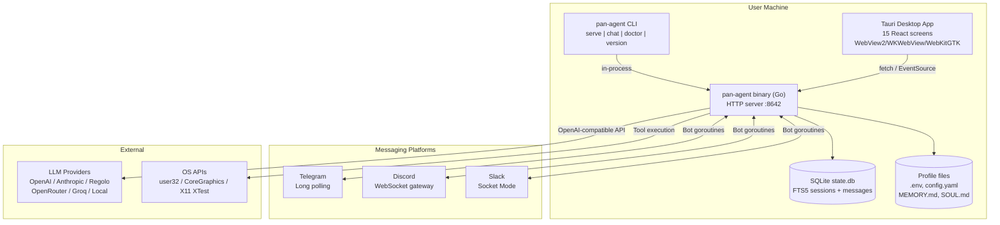

# System Overview

Pan-Agent is easiest to understand if you remember one fact: it is a single Go binary that speaks HTTP.

## System context



## What this system is
A local AI agent with full PC control. Every chat request runs through an agent loop that streams responses, executes tools, asks for approval on dangerous operations, and persists conversation state. Optional messaging bots let you chat with your agent from Telegram, Discord, or Slack.

## One binary, three roles

### HTTP server (default)
The primary mode. Serves 56 REST + SSE endpoints on `localhost:8642`.

```bash
pan-agent serve --port 8642
```

The desktop app, CLI, and bots all talk to this server. Even `pan-agent chat` is technically a separate process from `pan-agent serve` — the chat command embeds its own LLM client and doesn't go through HTTP.

### CLI chat
Interactive terminal chat that talks directly to the LLM provider. Useful when you don't want the desktop app running.

```bash
pan-agent chat --model kimi-k2-0905 --profile work
```

### Health check
Runs the same checks as `POST /v1/config/doctor` and prints them to stdout.

```bash
pan-agent doctor
```

## Cross-platform PC control

The PC control tools (keyboard, mouse, window_manager) use a build-tag architecture:

| Tool | Windows | macOS | Linux |
|---|---|---|---|
| `screenshot` | GDI via lxn/win | CoreGraphics | X11 via jezek/xgb |
| `keyboard` | user32.dll SendInput | CGEventPost (CGo) | XTest FakeInput |
| `mouse` | user32.dll SendInput | CGEventCreateMouseEvent (CGo) | XTest + WarpPointer |
| `window_manager` | EnumWindows | CGWindowList + AppleScript | EWMH atoms |
| `ocr` | Vision LLM | Vision LLM | Vision LLM |

Tools register themselves in `init()` only on platforms where they work. On unsupported platforms (e.g., FreeBSD), the tool is invisible to the LLM.

## Storage layout

| Platform | AgentHome path |
|---|---|
| Windows | `%LOCALAPPDATA%\pan-agent\` |
| macOS | `~/Library/Application Support/pan-agent/` |
| Linux | `~/.local/share/pan-agent/` |

Inside AgentHome:
- `state.db` — SQLite with FTS5 for sessions + messages
- `.env` — API keys (per-profile)
- `config.yaml` — provider, model, platform toggles (per-profile)
- `MEMORY.md`, `USER.md`, `SOUL.md` — agent memory and persona (per-profile)
- `models.json` — cached model library
- `auth.json` — credential pool
- `cron/jobs.json` — scheduled tasks
- `skills/` — installed skills
- `profiles/<name>/` — additional profile directories

## Operator rule
The HTTP server binds to `127.0.0.1` only and has no authentication. This is by design for a single-user desktop app. Do not bind to `0.0.0.0` or expose the port through any tunnel.

## Read next
- [[02 - How It All Fits Together]]
- [[03 - Top 10 Things Every User Should Know]]
- [[01 - Service Architecture]]
