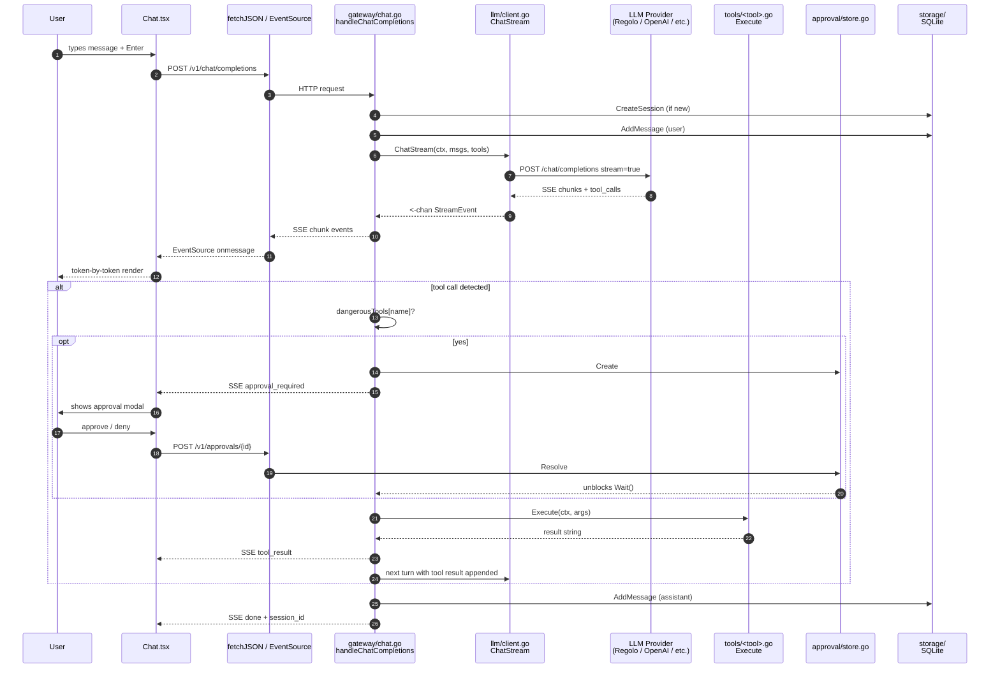
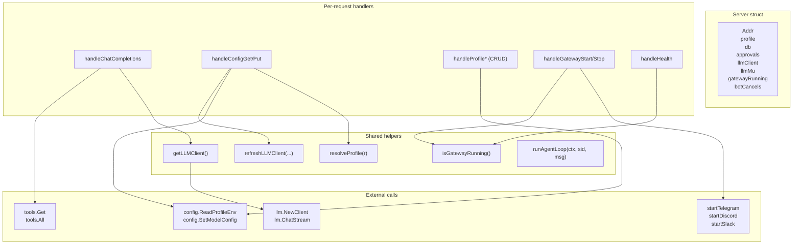

# How It All Fits Together

This note traces a single chat message from the user pressing Enter to the response appearing on screen.

## The full chat round trip

## What the desktop app does

The Tauri app loads the React bundle and talks to `localhost:8642` via plain `fetch` and `EventSource`. There is no Tauri command bridge for the chat — Tauri only manages the window, the WebView, the sidecar process spawn, and the auto-updater.

Sidecar spawn: Tauri's `externalBin` config in `tauri.conf.json` declares `binaries/pan-agent` (with the platform target triple appended). On app launch, `tauri-plugin-shell` spawns this binary as a child process with a default working directory of the AgentHome. The Go binary opens its database, registers tools, and starts the HTTP server.

## What the Go backend does

The `gateway` package wires everything together:

## What the bot goroutines do

When you click "Start Gateway" on the Gateway screen:

1. `handleGatewayStart` reads `config.GetPlatformEnabled(profile)` and `config.ReadProfileEnv(profile)`.
2. For each enabled platform with a token configured, it calls `startTelegram(...)` / `startDiscord(...)` / `startSlack(...)`.
3. Each `start*` function returns a `context.CancelFunc`. The Server struct keeps these in `botCancels[platform]`.
4. The bot runs in a goroutine, polling/listening for messages.
5. On incoming message, the bot calls `s.runAgentLoop(ctx, sessionID, text)` — the same agent loop the HTTP chat handler uses, minus the SSE streaming.
6. The bot sends the final response back to the platform.

`handleGatewayStop` iterates `botCancels` and calls each `cancel()` to stop the bot goroutines.

## What the approval system does

Tools listed in `dangerousTools` (terminal, filesystem, code_execution, browser) trigger an approval flow:

1. `executeToolCall` creates an `Approval` record in the in-memory `approval.Store`.
2. An `approval_required` SSE event is sent with the approval ID.
3. The handler blocks on `s.approvals.Wait(approvalID, ctx.Done())`.
4. The frontend modal POSTs `/v1/approvals/{id}` with `{approved: bool}`.
5. `approval.Store.Resolve` unblocks the wait.
6. If approved, the tool runs; otherwise, an error is returned to the model.

Bot conversations skip this entirely — there is no SSE stream for an approval modal to attach to. Bots auto-approve all tools.

## Read next
- [[03 - Top 10 Things Every User Should Know]]
- [[01 - Service Architecture]]
- [[02 - HTTP API Surface]]
