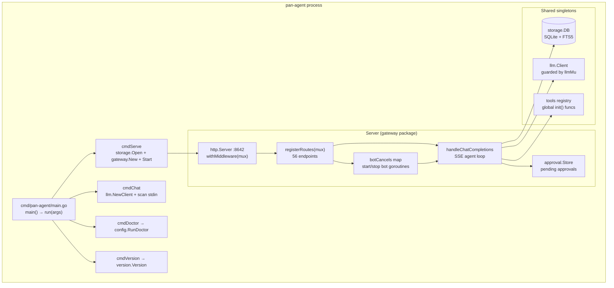

# Service Architecture

This note describes the in-process service composition of the Go binary.

## Process model



## Package layout

| Package | Purpose |
|---|---|
| `cmd/pan-agent` | CLI entry point. Parses subcommand and flags, dispatches to handler. |
| `internal/gateway` | HTTP server, route handlers, chat agent loop, bot lifecycle. |
| `internal/llm` | OpenAI-compatible streaming client. SSE parser with tool-call accumulation. |
| `internal/tools` | Tool interface and 20+ implementations. Cross-platform via build tags. |
| `internal/approval` | Approval store + 103 dangerous command regex patterns. |
| `internal/storage` | SQLite (modernc.org pure Go) with FTS5 sessions/messages. |
| `internal/config` | Profile-based `.env` and `config.yaml` management, profile CRUD, doctor. |
| `internal/memory` | MEMORY.md + USER.md persistent memory with `§` delimiter. |
| `internal/persona` | SOUL.md persona system. |
| `internal/models` | Model library + remote sync. |
| `internal/skills` | Skill discovery, install, uninstall. |
| `internal/cron` | Scheduled task management. |
| `internal/paths` | Cross-platform path resolution (AgentHome, ProfileHome, etc.). |
| `internal/claw3d` | Process management for the pan-office subprocess. |
| `internal/version` | Build-time version constants (overridden via ldflags). |
| `internal/parentwatch` | Parent-process watchdog — sidecar terminates itself if `PAN_AGENT_PARENT_PID` dies (symmetric with Tauri killing the child). Shipped in v0.4.1. |
| `internal/secret` | Phase 12 WS1 (unreleased on `main`): OS keyring wrapper + HMAC-based redaction for approval prompts / journal entries. Not yet wired into tool execution. |
| `internal/recovery` | Phase 12 WS2 (unreleased on `main`): action journal + filesystem/registry/browser snapshots + reversers + `/v1/recovery/*` endpoints. Not yet wired into tool execution. |

## Server lifecycle

```go
// cmd/pan-agent/main.go
func cmdServe(args []string) error {
    db, _ := storage.Open(paths.StateDB())
    defer db.Close()

    srv := gateway.New(addr, db, profile)

    quit := make(chan os.Signal, 1)
    signal.Notify(quit, syscall.SIGINT, syscall.SIGTERM)

    errCh := make(chan error, 1)
    go func() { errCh <- srv.Start() }()

    select {
    case <-quit:
        ctx, cancel := context.WithTimeout(context.Background(), 10*time.Second)
        defer cancel()
        return srv.Stop(ctx)
    case err := <-errCh:
        return err
    }
}
```

The server starts in a goroutine, the main goroutine blocks on a signal or a startup error. Graceful shutdown gives in-flight requests up to 10 seconds to finish.

## Concurrency model

- The `http.Server` handles one request per goroutine (Go stdlib default).
- The `llm.Client` is read via `getLLMClient()` (RLock), replaced via `refreshLLMClient()` (Lock). One mutex guards the pointer; the client itself is goroutine-safe internally.
- The approval `Store` uses its own mutex for the pending-approvals map.
- Bot goroutines run independently. Each has its own context; `handleGatewayStop` cancels them all.
- The SQLite database is opened with `MaxOpenConns(1)` to serialize writes (modernc/sqlite is safe but slow under contention).
- The tool registry is populated by `init()` functions. After server start, it is read-only.

## Why no third-party HTTP framework

Go 1.22+ added pattern-based routing to `net/http.ServeMux` — `mux.HandleFunc("POST /v1/config/profiles", h)` and `r.PathValue("name")`. This covers everything Pan-Agent needs. No router (gin, echo, chi) is necessary. Middleware is a single `withMiddleware(mux)` wrapper applying CORS and request logging.

## Why no dependency injection framework

The `Server` struct holds all dependencies as fields. `gateway.New(addr, db, profile)` takes the only two unavoidable inputs (DB and profile name) and constructs everything else. There are no globals except the tool registry and the abort registry — both written once at init or under explicit mutexes.

## Read next
- [[02 - HTTP API Surface]]
- [[03 - Cross-Platform Tool Architecture]]
- [[04 - Data and Storage]]
