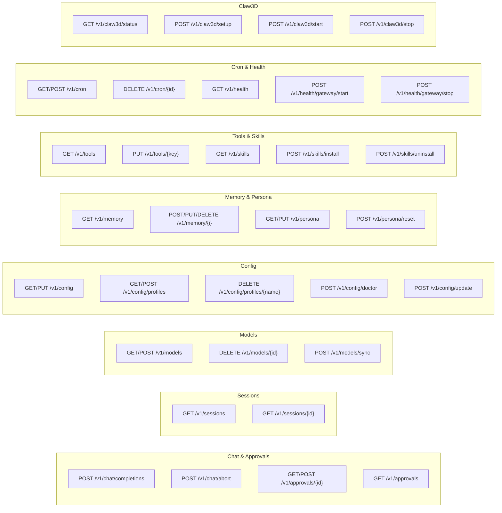

# HTTP API Surface

This note describes the shape and conventions of the Pan-Agent HTTP API. For the full endpoint catalog, see [[00 - HTTP API Reference]].

## Base URL and CORS

| Item | Value |
|---|---|
| Base URL | `http://127.0.0.1:8642` |
| Allowed origins | `http://localhost:5173` (Vite dev), `tauri://localhost` (production app) |
| Auth | None |
| Content-Type | `application/json` (most), `text/event-stream` (chat), `application/x-ndjson` (claw3d setup) |

The `withMiddleware` wrapper in `internal/gateway/middleware.go` adds CORS and request logging. There is no auth middleware.

## Endpoint conventions

- All endpoints are versioned under `/v1/`.
- Method + path is the routing key (Go 1.22+ ServeMux pattern syntax).
- Path parameters use `{name}` syntax and are read via `r.PathValue("name")`.
- Query parameters: `?profile=<name>`, `?limit=50`, `?offset=0`, `?q=search`.
- Response shape: success returns the resource directly. Errors return `{"error": "..."}`.
- Profile resolution: `?profile=` query param wins; otherwise the server's startup profile (default).

## Resource groups



## SSE format (chat)

The chat endpoint returns Server-Sent Events. Each line is `data: <json>` followed by a blank line.

Event types:
- `chunk` — partial assistant text. `{"type":"chunk","content":"..."}`
- `tool_call` — model wants to call a tool. `{"type":"tool_call","tool_call":{...}}`
- `approval_required` — dangerous tool needs approval. `{"type":"approval_required","tool_call":{...},"approval_id":"..."}`
- `tool_result` — tool finished executing. `{"type":"tool_result","tool_call_id":"...","result":"..."}`
- `usage` — token usage from the LLM. `{"type":"usage","usage":{...}}`
- `error` — fatal error in the agent loop. `{"type":"error","error":"..."}`
- `done` — stream finished. `{"type":"done","session_id":"..."}`

Stream terminates with `data: [DONE]\n\n`.

## Config response shape (v0.1.1+)

`GET /v1/config` returns:

```json
{
  "env": {"REGOLO_API_KEY": "sk-...", "OPENROUTER_API_KEY": ""},
  "agentHome": "C:\\Users\\bertc\\AppData\\Local\\pan-agent",
  "model": {
    "provider": "regolo",
    "model": "Llama-3.3-70B-Instruct",
    "baseUrl": "https://api.regolo.ai/v1"
  },
  "credentialPool": {
    "openrouter": [{"key": "sk-or-...", "label": "Work"}]
  },
  "appVersion": "0.4.4",
  "agentVersion": null
}
```

`PUT /v1/config` accepts a union body:

```json
{
  "profile": "work",
  "env": {"REGOLO_API_KEY": "sk-new"},
  "model": {"provider": "regolo", "model": "...", "baseUrl": "..."},
  "credentialPool": {"openrouter": [...]},
  "platformEnabled": {"telegram": true}
}
```

Each field is optional. Only non-nil/non-empty fields are processed.

## Health response shape (v0.1.1+)

`GET /v1/health` returns:

```json
{
  "gateway": false,
  "env": {"TELEGRAM_BOT_TOKEN": "...", "DISCORD_BOT_TOKEN": ""},
  "platformEnabled": {
    "telegram": false, "discord": false, "slack": false,
    "whatsapp": false, "signal": false
  }
}
```

The `gateway` field reflects the in-memory `gatewayRunning` bool. It does NOT survive server restart — restart resets it to false even if bot processes were running before.

## Operator rule
The HTTP API is for the desktop app and your own scripts. Do not expose it. Do not put it behind a reverse proxy. Do not add API key auth and call it a security boundary — the localhost binding is the boundary.

## Read next
- [[00 - HTTP API Reference]]
- [[03 - Cross-Platform Tool Architecture]]
- [[01 - Go Backend]]
