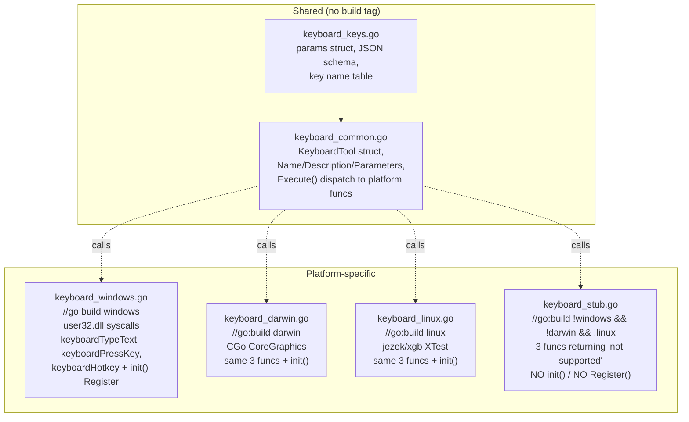

# Cross-Platform Tool Architecture

This note describes the build-tag pattern used to make PC control tools work on Windows, macOS, and Linux from one Go codebase.

## The problem

A naive Go file using `syscall.NewLazyDLL("user32.dll")` won't compile on macOS or Linux. CGo with `#include <CoreGraphics/CoreGraphics.h>` won't compile on Windows. The X11 `jezek/xgb` library only makes sense on Linux.

You cannot put platform-specific code in one file with `runtime.GOOS` checks — the imports won't even resolve.

## The pattern: shared common file + platform Execute() + stub fallback

For each PC control tool (keyboard, mouse, window_manager), there are 4-5 files:

## File responsibilities

### Shared (no build tag)

- **`<tool>_keys.go` / `<tool>_params.go`**: defines the parameter struct (e.g., `keyboardParams`) and the JSON Schema string. Also contains platform-neutral helpers like the named-key list.
- **`<tool>_common.go`**: defines the tool struct (e.g., `KeyboardTool`), implements `Name()`, `Description()`, `Parameters()`, and `Execute()`. The `Execute` method validates input and dispatches to free functions like `keyboardTypeText(text)` that platform files implement.

### Platform files (with build tags)

Each platform file:
1. Has a `//go:build <platform>` constraint at the top.
2. Implements the free functions that `Execute()` dispatches to (e.g., `keyboardTypeText`, `keyboardPressKey`, `keyboardHotkey`).
3. Has an `init()` that calls `Register(KeyboardTool{})` to register the tool with the global tool registry.

### Stub file

- `//go:build !windows && !darwin && !linux` — matches FreeBSD, OpenBSD, etc.
- Implements the same free functions, returning `fmt.Errorf("...not supported on %s", runtime.GOOS)`.
- Does NOT register the tool. On unsupported platforms, the tool is invisible to the LLM.

## Why this matters: tool visibility per platform

If we just had a stub `Execute` that always errored, the tool would still appear in `tools.All()` and the LLM would see it in the tool list. The LLM would then try to use it and get errors back.

By only registering tools in platform files (not in `_common.go`), the tool genuinely doesn't exist on unsupported platforms. The LLM never sees it. No wasted tokens trying to call unavailable tools.

## Library choices per platform

| Platform | Approach | Library | CGo? |
|---|---|---|---|
| Windows | user32.dll syscalls | stdlib `syscall` | No |
| macOS | CGo with CoreGraphics framework | system frameworks | Yes (`-framework CoreGraphics -framework Carbon -framework ApplicationServices`) |
| Linux | X11 XTest extension | `github.com/jezek/xgb` (already an indirect dep via kbinani/screenshot) | No |

## Why we did NOT use robotgo

`go-vgo/robotgo` is the obvious "all-in-one" option. We rejected it because:
- Heavy CGo dependency chain on every platform (libpng, zlib, OpenCV optional).
- Build issues are common on CI.
- The window management API is much weaker than what we already had on Windows.
- We only need input injection — robotgo is overkill.

Custom platform files using minimal CGo on macOS and pure Go via xgb on Linux are lighter and give us full API control.

## macOS specifics

- **Frameworks linked**: CoreGraphics (input events), Carbon (key codes), ApplicationServices (window listing).
- **Window manipulation**: uses `osascript` AppleScript for move/resize/close. This requires Accessibility permission to be granted to Pan Desktop.
- **Window listing**: uses `CGWindowListCopyWindowInfo` which works without permission.
- **macOS 15 SDK quirk**: `CGDisplayCreateImageForRect` (used by `kbinani/screenshot`) is marked `unavailable` (not just deprecated) in macOS 15. CI sets `MACOSX_DEPLOYMENT_TARGET=14.0` so the macOS 14 SDK is targeted where the API is still available.

## Linux specifics

- **`jezek/xgb` was already an indirect dep** via `kbinani/screenshot`. Promoting it to a direct dep cost zero new downloads.
- **XTest extension** provides `FakeInput(c, type, detail, time, root, x, y, deviceid)` which covers keyboard, mouse buttons, and motion notify in one function.
- **Cursor movement**: prefer `xproto.WarpPointer` over XTest motion — it doesn't need the XTest extension.
- **Keysym → keycode resolution**: done at runtime via `xproto.GetKeyboardMapping` so non-QWERTY layouts (AZERTY, Dvorak, etc.) work correctly.
- **Window management**: EWMH atoms (`_NET_CLIENT_LIST`, `_NET_ACTIVE_WINDOW`, `_NET_CLOSE_WINDOW`) and `xproto.ConfigureWindow` for move/resize.
- **Wayland**: not supported. XWayland works (default on GNOME/KDE on Wayland).

## Operator rule
Tool registration belongs in platform files only. The shared common file should never call `Register()`. This is the difference between a tool that gracefully doesn't exist on unsupported platforms vs one that exists but always returns errors.

## Read next
- [[04 - Tool Registry]]
- [[03 - PC Control Tool Issues]]
- [[01 - Go Backend]]
