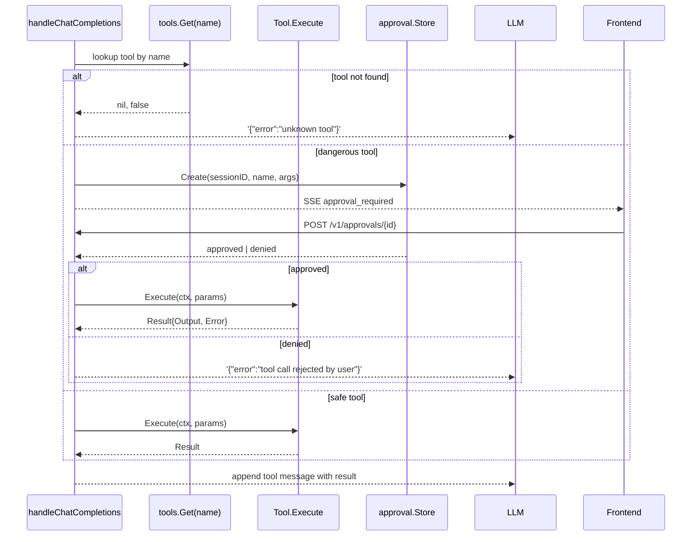

# Tool Registry

The `internal/tools` package defines the `Tool` interface and a global registry that maps tool names to implementations.

## Tool interface

```go
type Tool interface {
    Name() string                      // unique identifier
    Description() string                // human-readable, shown to the LLM
    Parameters() json.RawMessage        // JSON Schema for input
    Execute(ctx context.Context,
            params json.RawMessage) (*Result, error)
}

type Result struct {
    Output string  // tool result, shown to the LLM
    Error  string  // optional error string
    Denied bool    // true when approval was rejected
}
```

## Registry

```go
// Globally registered tools, populated by init() in each tool file
var registry = map[string]Tool{}

func Register(t Tool)         // overwrites existing entry with same name
func Get(name string) (Tool, bool)
func All() map[string]Tool    // shallow copy
```

The registry is populated at process start by `init()` functions in each tool file. After init, it is read-only — there is no runtime add/remove.

## Tool catalog (v0.4.4)

| Name | Description | Approval? | Cross-platform? |
|---|---|---|---|
| `terminal` | Execute shell commands | Yes | Yes |
| `filesystem` | Read/write/list files | Yes | Yes |
| `code_execution` | Run code in sandboxed environments | Yes | Yes |
| `browser` | Chromium automation via DevTools Protocol | Yes | Yes |
| `web_search` | Search the web | No | Yes |
| `screenshot` | Capture display | No | Yes |
| `keyboard` | Simulate keyboard input | No | Yes (Win/Mac/Linux) |
| `mouse` | Move cursor + click + scroll | No | Yes (Win/Mac/Linux) |
| `window_manager` | List, focus, move, resize, close windows | No | Yes (Win/Mac/Linux) |
| `ocr` | Extract text from screenshot via vision LLM | No | Yes |
| `vision` | Analyze images with vision LLM | No | Yes |
| `image_gen` | Generate images via API | No | Yes |
| `tts` | Text-to-speech synthesis | No | Yes |
| `clarify` | Ask user for clarification | No | Yes |
| `delegation` | Delegate to specialized sub-agents | No | Yes |
| `moa` | Mixture-of-Agents (query multiple models) | No | Yes |
| `memory_tool` | Read/write agent's persistent memory | No | Yes |
| `session_search` | Search past sessions (FTS5) | No | Yes |
| `todo` | Manage task lists | No | Yes |
| `cron_tool` | Schedule recurring tasks | No | Yes |

## Approval system

Tools listed in `dangerousTools` (defined in `internal/gateway/chat.go`) trigger an approval flow before execution:

```go
var dangerousTools = map[string]bool{
    "terminal":       true,
    "filesystem":     true,
    "code_execution": true,
    "browser":        true,
}
```

For dangerous tools, the chat handler emits an `approval_required` SSE event and blocks until the frontend resolves the approval via `POST /v1/approvals/{id}`.

Bots auto-approve everything. There is no SSE stream for an interactive approval modal.

## Tool execution flow



## Adding a tool

1. Create `internal/tools/mytool.go`:

```go
package tools

import (
    "context"
    "encoding/json"
    "fmt"
)

type MyTool struct{}

func (MyTool) Name() string        { return "my_tool" }
func (MyTool) Description() string { return "Does the thing." }

func (MyTool) Parameters() json.RawMessage {
    return json.RawMessage(`{
      "type": "object",
      "required": ["input"],
      "properties": {
        "input": {"type": "string"}
      }
    }`)
}

type myToolParams struct {
    Input string `json:"input"`
}

func (t MyTool) Execute(ctx context.Context, params json.RawMessage) (*Result, error) {
    var p myToolParams
    if err := json.Unmarshal(params, &p); err != nil {
        return &Result{Error: fmt.Sprintf("invalid parameters: %v", err)}, nil
    }
    return &Result{Output: "did the thing with " + p.Input}, nil
}

var _ Tool = MyTool{}

func init() { Register(MyTool{}) }
```

2. Build and run. The tool is now available to the LLM.

3. If the tool should require approval, add its name to `dangerousTools` in `internal/gateway/chat.go`.

## Read next
- [[05 - Approval System]]
- [[03 - Cross-Platform Tool Architecture]]
- [[02 - Tools Catalog]]
