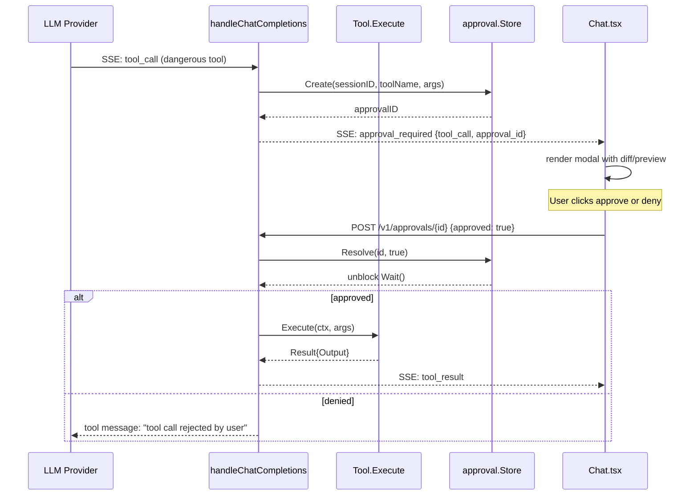

# Approval System

The `internal/approval` package classifies shell commands by danger level and gates dangerous tool calls behind user approval.

## Three levels

| Level | Constant | Behavior |
|---|---|---|
| Safe | `Safe` (0) | No approval needed |
| Dangerous | `Dangerous` (1) | Approval modal shown to user |
| Catastrophic | `Catastrophic` (2) | Blocked by default, even with approval |

The classifier uses regex pattern matching. There are 103 patterns total, ported from the predecessor Python implementation.

## Classification API

```go
type Result struct {
    Level   Level     // Safe | Dangerous | Catastrophic
    Pattern string    // the matched pattern, for diagnostics
}

func Check(cmd string) Result
```

Catastrophic patterns are checked before Dangerous patterns. The first match wins.

## Examples

| Command | Level |
|---|---|
| `echo hello` | Safe |
| `ls -la /tmp` | Safe |
| `git status` | Safe |
| `go test ./...` | Safe |
| `DELETE FROM users WHERE id = 1` | Safe (has WHERE) |
| `rm -rf /tmp/foo` | Dangerous |
| `git reset --hard HEAD~1` | Dangerous |
| `DROP TABLE users` | Dangerous |
| `DELETE FROM users` | Dangerous (no WHERE) |
| `kill -9 -1` | Dangerous |
| `vssadmin delete shadows /all /quiet` | Catastrophic |
| `bcdedit /set {default} recoveryenabled No` | Catastrophic |
| `format C: /FS:NTFS` | Catastrophic |
| `mimikatz sekurlsa::logonpasswords` | Catastrophic |
| `del /s /q C:\` | Catastrophic |

## Approval store

```go
type Store struct { /* ... */ }

func NewStore() *Store

func (s *Store) Create(sessionID, toolName, args string) *Approval
func (s *Store) Get(id string) (*Approval, error)
func (s *Store) Resolve(id string, approved bool) error
func (s *Store) Wait(id string, done <-chan struct{}) (Status, error)
func (s *Store) ListPending() []*Approval
```

`Wait` blocks until the approval is resolved OR the `done` channel closes (e.g., context cancellation). Returns `StatusApproved` or `StatusRejected`.

## Approval flow in chat



If the user closes the chat or cancels via `POST /v1/chat/abort`, the context is cancelled and `Wait` returns an error.

## Pattern coverage

The 103 patterns cover (non-exhaustive):

- **Filesystem**: `rm -rf`, `del /s /q`, `format`, `mkfs.*`, recursive write to system paths
- **Database**: `DROP TABLE`, `DROP DATABASE`, `DELETE FROM <table>` (no WHERE), `TRUNCATE`
- **Git**: `git reset --hard`, `git push --force` to protected branches, `git filter-branch`
- **Process control**: `kill -9 -1`, `pkill .*`, `taskkill /f /im *`
- **Boot/recovery**: `bcdedit`, `vssadmin delete shadows`, `wbadmin delete`, `wmic shadowcopy delete`
- **Credential extraction**: `mimikatz`, `procdump lsass`, registry hives access
- **Network exfiltration**: `curl <internal-host> -d`, large `tar | nc`, `Compress-Archive` of sensitive paths
- **Privilege escalation**: `sudo su`, `runas`, `psexec` to remote hosts
- **Sensitive file access**: write to `/etc/`, `/dev/sd*`, `~/.ssh/`, `~/.aws/`, `~/.docker/config.json`

## Hermes legacy

A handful of patterns still reference `.hermes/` paths (the predecessor data directory). These are kept for backward compatibility but should be augmented with `.pan-agent/` equivalents in a future release.

## Operator rule
The approval system is a safety net, not a security boundary. A determined attacker with code execution on the user's machine has many ways around it. The approval modal exists to prevent the LLM from making expensive mistakes, not to defend against malice.

## Read next
- [[04 - Tool Registry]]
- [[05 - Security Model]]
- [[01 - Chat]]
