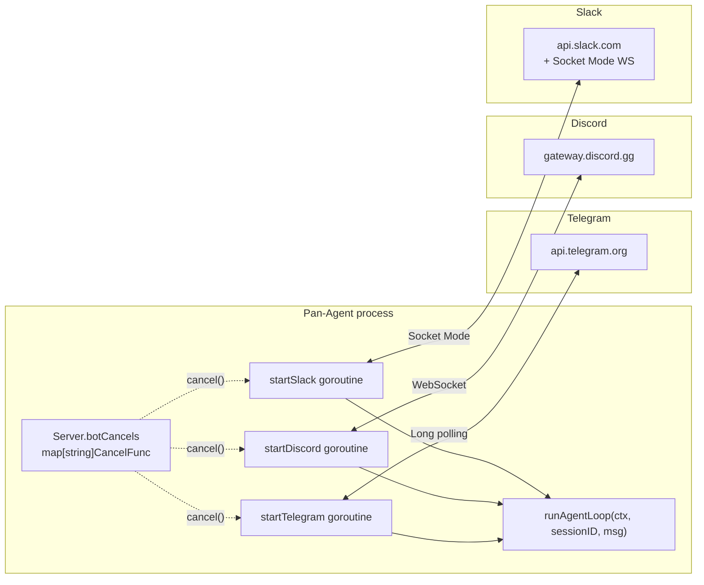

# Messaging Gateway Bots

The gateway bots let users chat with their Pan-Agent from Telegram, Discord, or Slack. Each bot runs as a goroutine inside the Go backend.

## Architecture



## Lifecycle

`POST /v1/health/gateway/start`:
1. Reads `config.GetPlatformEnabled(profile)` and `config.ReadProfileEnv(profile)`.
2. For each enabled platform with a configured token, calls `s.startTelegram(...)` / `s.startDiscord(...)` / `s.startSlack(...)`.
3. Each `start*` returns a `context.CancelFunc`. Stored in `s.botCancels[platform]`.
4. Sets `s.gatewayRunning = true`.

`POST /v1/health/gateway/stop`:
1. Iterates `s.botCancels` and calls each `cancel()`.
2. Sets `s.gatewayRunning = false`.

The `gatewayRunning` bool is in-memory only. It does NOT survive server restart — restart resets it to false even if bot processes were running before.

## Telegram (mymmrac/telego)

```go
func (s *Server) startTelegram(token, allowedUsers string) (context.CancelFunc, error)
```

- **Transport**: long polling (no public URL needed).
- **Allowed users**: comma-separated user IDs in `TELEGRAM_ALLOWED_USERS`. If set and non-empty, only those users can interact with the bot. Other users get "Access denied."
- **Session mapping**: `sessionID = fmt.Sprintf("tg-%d", message.Chat.ID)`. Each Telegram chat is a separate persistent session.
- **Message splitting**: Telegram has a 4096-character limit per message. Long responses are split into multiple messages.

## Discord (bwmarrin/discordgo)

```go
func (s *Server) startDiscord(token string) (context.CancelFunc, error)
```

- **Transport**: WebSocket gateway connection.
- **Intents**: `GuildMessages | DirectMessages | MessageContent`. The Message Content intent requires explicit enablement in the Discord Developer Portal as of September 2022.
- **Self-message filter**: ignores `m.Author.ID == sess.State.User.ID` to prevent feedback loops.
- **Session mapping**: `sessionID = fmt.Sprintf("dc-%s", m.ChannelID)`. Each Discord channel is a separate session.
- **Message splitting**: Discord has a 2000-character limit per message.

## Slack (slack-go/slack with Socket Mode)

```go
func (s *Server) startSlack(botToken, appToken string) (context.CancelFunc, error)
```

- **Transport**: Socket Mode (no public URL needed).
- **Required tokens**:
    - `SLACK_BOT_TOKEN` — `xoxb-...` from OAuth & Permissions.
    - `SLACK_APP_TOKEN` — `xapp-...` app-level token, required for Socket Mode.
- **Event handling**: subscribes to `MessageEvent` via Events API. Ignores bot messages (`ev.BotID != ""`) and message subtype events.
- **Session mapping**: `sessionID = fmt.Sprintf("sl-%s", ev.Channel)`.
- **Message splitting**: 4000 characters per message (Slack's actual limit is 40000, but readability suffers above 4000).

## Shared agent loop

All three bots call `s.runAgentLoop(ctx, sessionID, userMessage) (string, error)`:

1. Persists the user message to SQLite.
2. Reads the persona from `SOUL.md` and prepends it as a system message.
3. Calls the LLM via `client.ChatStream(ctx, msgs, nil)` (no tools passed — bots don't expose tools currently).
4. Drains the stream, accumulating the response.
5. If the response contains tool calls, executes them via `s.dispatchTool(ctx, tc)` (no approval gate).
6. Loops up to 20 turns until no more tool calls.
7. Returns the final assistant content.

## Why bots auto-approve

There is no SSE stream attached to a Telegram or Slack message. There is no place to render an interactive approval modal. Routing approval requests through the messaging channel itself ("Reply 'yes' to approve") was considered and rejected as too fragile.

The mitigation is: restrict who can talk to your bot.

## Required setup steps per platform

### Telegram
1. Talk to `@BotFather` on Telegram. Run `/newbot`.
2. Save the bot token. Paste into Pan-Agent's Gateway screen.
3. Optionally restrict access: add your Telegram user ID to `TELEGRAM_ALLOWED_USERS` (comma-separated for multiple).
4. Enable the Telegram toggle. Click Start Gateway.

### Discord
1. Go to https://discord.com/developers/applications. Create an application.
2. Bot tab → Add Bot. Copy the token.
3. Bot tab → Privileged Gateway Intents → enable Message Content Intent.
4. OAuth2 → URL Generator → scopes: `bot`, permissions: `Send Messages`, `Read Message History`. Use the URL to add the bot to your server.
5. Paste token into Pan-Agent's Gateway screen. Enable toggle. Start.

### Slack
1. Go to https://api.slack.com/apps. Create an app.
2. OAuth & Permissions → Bot Token Scopes: `chat:write`, `channels:history`, `groups:history`, `im:history`, `mpim:history`. Install to workspace. Copy the `xoxb-` token.
3. Socket Mode → enable. Generate an app-level token with `connections:write`. Copy the `xapp-` token.
4. Event Subscriptions → enable. Subscribe to bot events: `message.channels`, `message.groups`, `message.im`, `message.mpim`.
5. Paste both tokens into Pan-Agent. Enable toggle. Start.

## Operator rule
Bot tokens are full credentials to a chat platform identity. Treat them like passwords. Never commit `.env` files. The `.gitignore` already excludes `*.key` files but should also exclude `.env`.

## Read next
- [[02 - Gateway Bot Issues]]
- [[01 - Chat]]
