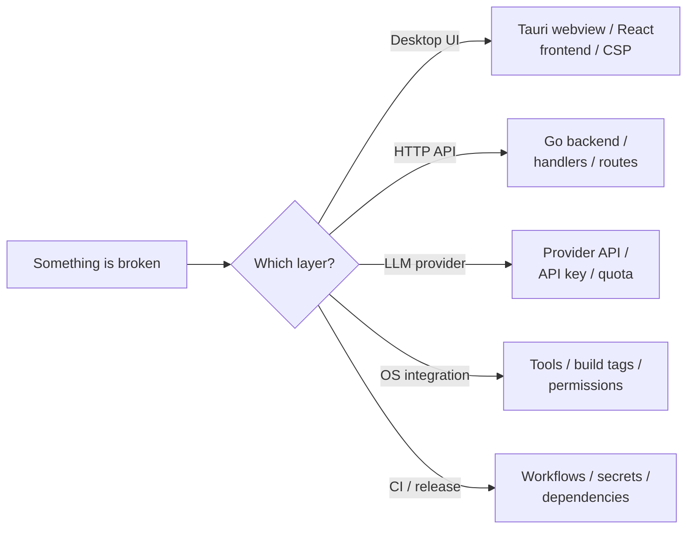

# Troubleshooting Index

Use this note to find the right runbook fast.

## Symptom → runbook

| Symptom | Runbook |
|---|---|
| Setup wizard appears repeatedly | [[01 - Setup Wizard Issues]] |
| Setup wizard never appears even though I have no key | [[01 - Setup Wizard Issues]] |
| Telegram bot doesn't respond to messages | [[02 - Gateway Bot Issues]] |
| Discord bot connects but ignores messages | [[02 - Gateway Bot Issues]] |
| Slack bot fails to start | [[02 - Gateway Bot Issues]] |
| Screenshot returns empty / black image | [[03 - PC Control Tool Issues]] |
| Keyboard tool reports "not supported" | [[03 - PC Control Tool Issues]] |
| Window manager can't find target window | [[03 - PC Control Tool Issues]] |
| `npm ci` fails in CI | [[04 - Build and CI Issues]] |
| macOS build fails with `CGDisplayCreateImageForRect unavailable` | [[04 - Build and CI Issues]] |
| Tauri build: "no private key" | [[04 - Build and CI Issues]] |
| `pan-agent doctor` reports a failed check | [[01 - Installation and First Run]] |

## Process layer → likely culprit



- **Desktop UI**: open browser dev tools in the Tauri webview (right-click → Inspect, requires dev build). Check console for CSP violations and fetch errors.
- **HTTP API**: `curl http://localhost:8642/v1/health` and look at the Go backend's stderr.
- **LLM provider**: check your API key has quota. Try the provider's own endpoint directly with curl.
- **OS integration**: check the tool actually registered on your platform (`GET /v1/tools` should list it).
- **CI / release**: read the GitHub Actions logs. The error is usually in the last ~50 lines of a failed step.

## Health check commands

```bash
# Backend up?
curl -sf http://localhost:8642/v1/health | jq .gateway

# What model is configured?
curl -sf http://localhost:8642/v1/config | jq .model

# What tools are registered?
curl -sf http://localhost:8642/v1/tools | jq '.[].name'

# Run full diagnostics
curl -sf -X POST http://localhost:8642/v1/config/doctor | jq -r .output

# Check for active gateway bots
curl -sf http://localhost:8642/v1/health | jq '{gateway, platformEnabled}'
```

## Diagnostic data to collect

When filing a bug report, attach:

1. Output of `pan-agent doctor` (or `POST /v1/config/doctor`)
2. Output of `pan-agent version`
3. Platform: `uname -a` (Unix) or `systeminfo | findstr OS` (Windows)
4. Backend stderr (run `pan-agent serve` from a terminal, reproduce, copy logs)
5. Browser dev tools console output (if a UI bug)

## Read next
- [[01 - Setup Wizard Issues]]
- [[02 - Gateway Bot Issues]]
- [[03 - PC Control Tool Issues]]
- [[04 - Build and CI Issues]]
