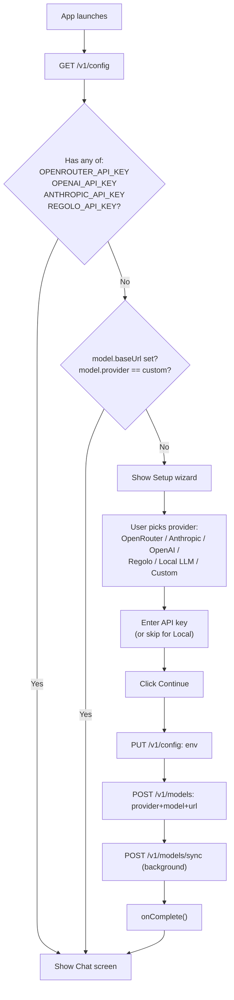

# Installation and First Run

This runbook walks through installing Pan-Agent and getting to a working chat session.

## Pick your installation method

| Method | Use when |
|---|---|
| Desktop installer | You want the GUI experience. Recommended. |
| Standalone binary | You want headless / server / CI usage. |
| Build from source | You're contributing or need a custom build. |

## Method 1 — Desktop installer

1. Visit https://github.com/Euraika-Labs/pan-agent/releases.
2. Download the latest installer for your platform:

| Platform | File | Size |
|---|---|---|
| Windows x64 | `Pan.Desktop_x.x.x_x64-setup.exe` (NSIS) | ~25 MB |
| Windows x64 | `Pan.Desktop_x.x.x_x64_en-US.msi` (MSI) | ~30 MB |
| macOS ARM | `Pan.Desktop_x.x.x_aarch64.dmg` | ~30 MB |
| Linux x64 | `Pan.Desktop_x.x.x_amd64.deb` | ~25 MB |
| Linux x64 | `Pan.Desktop_x.x.x_amd64.AppImage` | ~30 MB |

3. Run the installer.
   - **Windows**: SmartScreen will warn ("unrecognized app"). Click "More info" → "Run anyway". Pan-Agent ships unsigned.
   - **macOS**: First launch is blocked by Gatekeeper. Right-click the app → Open → click Open in the dialog. Or run `xattr -cr "/Applications/Pan Desktop.app"`.
   - **Linux**: For AppImage, `chmod +x Pan.Desktop_*.AppImage` and run.

4. Launch the app. The Setup Wizard appears.

## Method 2 — Standalone binary

Headless usage (no GUI). Useful for servers, CI, or Linux without X.

```bash
# Download from releases page or build:
go build -o pan-agent ./cmd/pan-agent

# Move to PATH
sudo mv pan-agent /usr/local/bin/

# Start the API server
pan-agent serve --port 8642 &

# Or use the interactive CLI
pan-agent chat --model gpt-4o-mini
```

## Method 3 — Build from source

Prerequisites:
- Go 1.25.7 (per `go.mod`; any 1.25.x from 1.25.0 up works)
- Node.js 22+ with npm (only for the desktop app)
- Rust via rustup for the Tauri build (`rustup default stable`)
- Linux: `libwebkit2gtk-4.1-dev libappindicator3-dev librsvg2-dev patchelf libgtk-3-dev libsoup-3.0-dev libjavascriptcoregtk-4.1-dev`
- macOS: Xcode Command Line Tools

Before running any native desktop build, confirm the local desktop toolchain is actually available:

```bash
rustup default stable
rustup show
cargo --version
rustc --version
```

If `npm run check:tauri` or `npx tauri build` fails with `rustup could not choose a version of cargo to run`, rustup has no default toolchain yet. Run `rustup default stable` and retry.

```bash
git clone https://git.euraika.net/euraika/pan-agent.git
cd pan-agent

# Backend
go build -o pan-agent.exe ./cmd/pan-agent
go test ./... -count=1 -timeout 120s

# Frontend (locked install + repo checks)
cd desktop
npm ci
npm run lint
npm run typecheck
npm run build:vite

# Native Tauri shell
npm run check:tauri

# Full Tauri installer (needs Rust + Go sidecar)
# Build the Go sidecar with the target-triple filename Tauri expects.
# Example for Linux x86_64; replace the filename on other platforms:
#   Windows: pan-agent-x86_64-pc-windows-msvc.exe
#   macOS ARM: pan-agent-aarch64-apple-darwin
#   Linux x86_64: pan-agent-x86_64-unknown-linux-gnu
cd ..
go build -o desktop/src-tauri/binaries/pan-agent-x86_64-unknown-linux-gnu ./cmd/pan-agent
cd desktop
# For local unsigned testing builds, use --no-sign.
npx tauri build --no-sign
```

On macOS, set `MACOSX_DEPLOYMENT_TARGET=14.0` before building the Go binary.

## First-run setup wizard

The Setup Wizard appears on first launch when no LLM provider is configured.



## Provider selection guide

- **OpenRouter (recommended)** — 200+ models from many providers via one key. Pay-per-token.
- **Anthropic** — Direct Claude access. Requires Anthropic API access.
- **OpenAI** — Direct GPT access. Requires OpenAI API access.
- **Regolo** — EU-hosted open models. Euraika Labs partner provider.
- **Local LLM** — Runs models on your machine. Requires LM Studio, Ollama, vLLM, or llama.cpp installed and running.
- **Custom OpenAI-compatible** — Any other endpoint. You provide base URL and optionally an API key.

## Verification

```bash
# Health check
curl -sf http://localhost:8642/v1/health | jq

# Run diagnostics
pan-agent doctor

# Or via API
curl -sf -X POST http://localhost:8642/v1/config/doctor | jq -r .output
```

Expected `pan-agent doctor` output:
```
pan-agent doctor
----------------
  [OK] AgentHome exists — C:\Users\bertc\AppData\Local\pan-agent
  [OK] Profile .env readable — ...\pan-agent\.env
  [OK] API key present — REGOLO_API_KEY or OPENAI_API_KEY
  [OK] SQLite DB opens — ...\pan-agent\state.db
  [OK] Config file present — ...\pan-agent\config.yaml

All checks passed.
```

## Read next
- [[01 - Chat]]
- [[04 - Configuration Reference]]
- [[01 - Setup Wizard Issues]]
