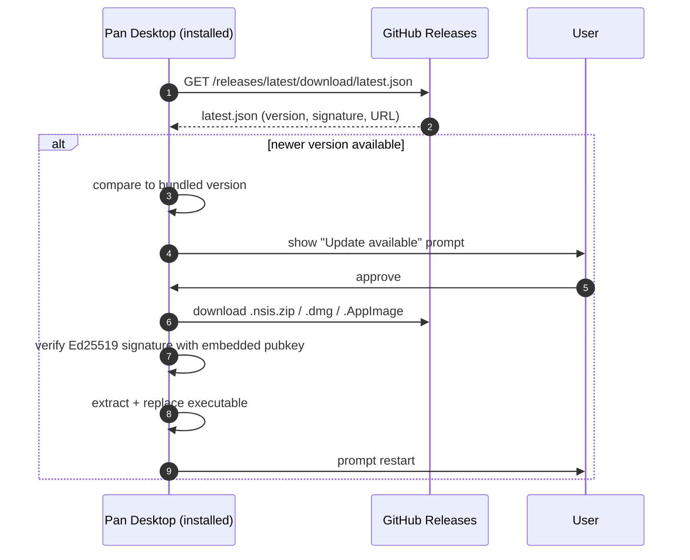

# Auto-Update System

Pan-Agent uses Tauri v2's updater plugin to deliver signed updates from GitHub Releases.

## How it works



## Components

| Piece | Location | Role |
|---|---|---|
| Updater plugin | `desktop/src-tauri/Cargo.toml` (`tauri-plugin-updater`) | Rust-side plugin |
| Plugin registration | `desktop/src-tauri/src/main.rs` | `.plugin(tauri_plugin_updater::Builder::new().build())` |
| Endpoint config | `desktop/src-tauri/tauri.conf.json` `plugins.updater` | Where to fetch `latest.json` |
| Public key | `desktop/src-tauri/tauri.conf.json` `plugins.updater.pubkey` | Verifies update signatures |
| ACL grant | `desktop/src-tauri/capabilities/default.json` | Frontend permission to invoke updater |
| Signed artifacts | Built by CI | `.nsis.zip` + `.sig` files |
| `latest.json` | Built by CI, uploaded to release | Version manifest the app polls |
| Frontend trigger | `desktop/src/screens/Settings/Settings.tsx` | "Check for updates" button |

## tauri.conf.json updater config

```json
"plugins": {
  "updater": {
    "endpoints": [
      "https://github.com/Euraika-Labs/pan-agent/releases/latest/download/latest.json"
    ],
    "pubkey": "dW50cnVzdGVkIGNvbW1lbnQ6IG1pbmlzaWduIHB1YmxpYyBrZXk6IEI0RUE3NUI4RkI5NzYwNjYK..."
  }
}
```

The endpoint URL uses GitHub's `/releases/latest/download/<file>` redirect, which always resolves to the most recent non-prerelease release.

## bundle.createUpdaterArtifacts

```json
"bundle": {
  "createUpdaterArtifacts": "v1Compatible",
  ...
}
```

This tells Tauri to generate `.nsis.zip` (Windows), `.app.tar.gz` (macOS), and `.AppImage.tar.gz` (Linux) files alongside the regular installer. These are what the updater downloads — they contain just the executable, not the full installer. The `.sig` file next to each is the Ed25519 signature.

`v1Compatible` means the artifact naming convention matches Tauri v1 — necessary for the `tauri-action` GitHub Action to find them.

## latest.json format

Generated by `tauri-action`:

```json
{
  "version": "0.4.4",
  "notes": "See the CHANGELOG for details.",
  "pub_date": "2026-04-17T00:00:00Z",
  "platforms": {
    "windows-x86_64": {
      "signature": "untrusted comment: signature from minisign secret key\nRWQ...base64...",
      "url": "https://github.com/Euraika-Labs/pan-agent/releases/download/v0.4.4/Pan.Desktop_0.4.4_x64-setup.nsis.zip"
    },
    "darwin-aarch64": {
      "signature": "...",
      "url": "https://github.com/.../Pan.Desktop_0.4.4_aarch64.app.tar.gz"
    },
    "linux-x86_64": {
      "signature": "...",
      "url": "https://github.com/.../pan-desktop_0.4.4_amd64.AppImage.tar.gz"
    }
  }
}
```

## Capabilities

Without the right capabilities, the frontend can't call the updater. From `capabilities/default.json`:

```json
{
  "permissions": [
    "core:default",
    "shell:allow-spawn",
    "shell:allow-execute",
    "shell:allow-open",
    "updater:default"
  ]
}
```

The `updater:default` permission grants `updater:allow-check`, `updater:allow-download`, and `updater:allow-install`.

## Frontend integration

Currently the Settings screen has a "Check for Updates" button that calls `POST /v1/config/update` (a backend stub returning `{available: false, current: "0.4.4"}`).

To wire up the actual Tauri updater:

```typescript
import { check } from "@tauri-apps/plugin-updater";
import { relaunch } from "@tauri-apps/plugin-process";

const update = await check();
if (update?.available) {
  await update.downloadAndInstall();
  await relaunch();
}
```

This is left as a follow-up — the infrastructure is in place, but the frontend button still hits the backend stub.

## Operator rule
The signing private key is the most important secret in this project. If it leaks, attackers can publish malicious updates that existing installs will trust. Store it only in GitHub Actions secrets and a personal password manager. Do not put it in any other CI, Slack, email, or shared document.

## Read next
- [[02 - Build and Release Pipeline]]
- [[05 - Security Model]]
